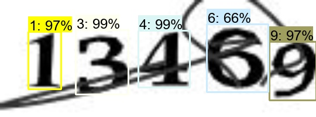
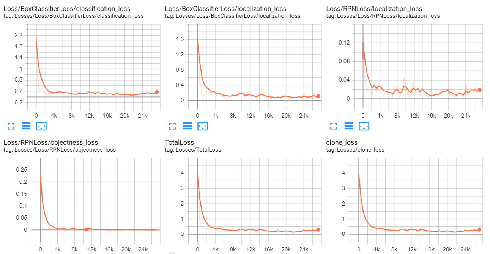

# Digit Capcha Detection
Digit Capcha Detection with Faster-RCNN




This repository contains Model and code for ```Digit Capcha Detection``` . We train a Faster-RCNN Model on about 25000 digits in 5000 capcha images



## Getting Started

Just clone the repository and run jupyter notebook !

### Prerequisites

You need to have installed the [Tensorflow Object Detection API](https://github.com/tensorflow/models/tree/master/research/object_detection).

Requirements :

```
- tensorflow_gpu==1.15.2
- opencv_python==4.1.0.25
- numpy==1.16.4
- imutils==0.5.2
- Pillow==6.2.1
- object_detection==0.0.3
- utils==0.9.0
```

## Authors

* **Ali Akbar Kiaei
* **Ali Sobhani
* **Fatemeh Khorshidi


## License

This project is licensed under the MIT License - see the [LICENSE.md](LICENSE.md) file for details


